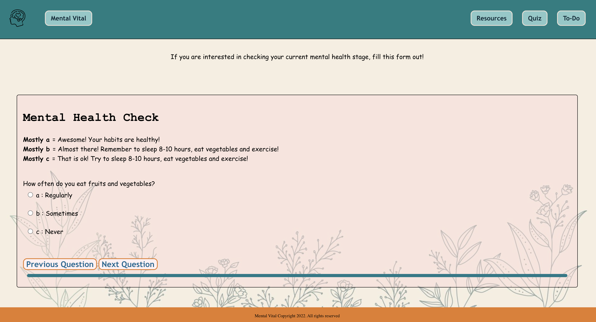

# Mental Vital 💭🧠


## Promoting Mental Health and Well-Being 💬🧠
Mental Vital is an interactive platform designed to help users assess and improve their mental health. By providing resources, quizzes, and tools for tracking well-being, it aims to educate individuals on the importance of mental health and offer practical steps to lead a healthier and happier life. 🌱💪

### Key Features:
1. **Mental Health Information**: Understand what mental health is and why it's crucial for overall well-being 💼
2. **Impact of Mental Health**: Discover how mental health affects productivity, stress management, and social relationships 💬
3. **Mental Health Check Quiz**: Take a short quiz to assess your mental health habits and get personalized feedback 📋
4. **Resources for Improvement**: Access helpful resources to improve mental health and cope with stress 🧠
5. **To-Do List for a Healthy Lifestyle**: Organize tasks like eating well, sleeping enough, and exercising regularly 📝

### Technology Used:
- **HTML** for structuring the website content 📄
- **CSS** for styling the website and creating a user-friendly design 🎨
- **JavaScript** for adding interactive elements such as the quiz and dynamic resources 🧠

### How to Run:
Clone the repository and open `index.html` in your browser to explore the site, take the quiz, and start improving your mental health today! 💪

```bash
git clone https://github.com/YuYeon-K/mental-vital.git
cd mental-vital
open index.html
